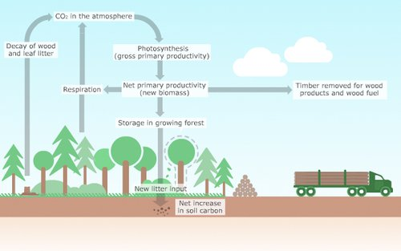
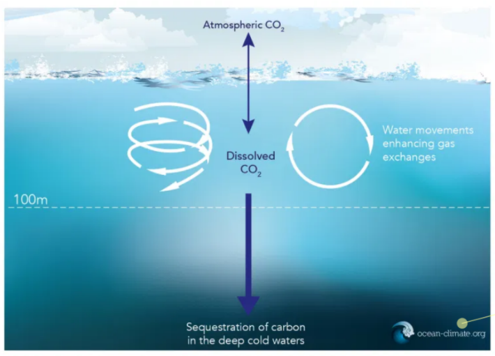
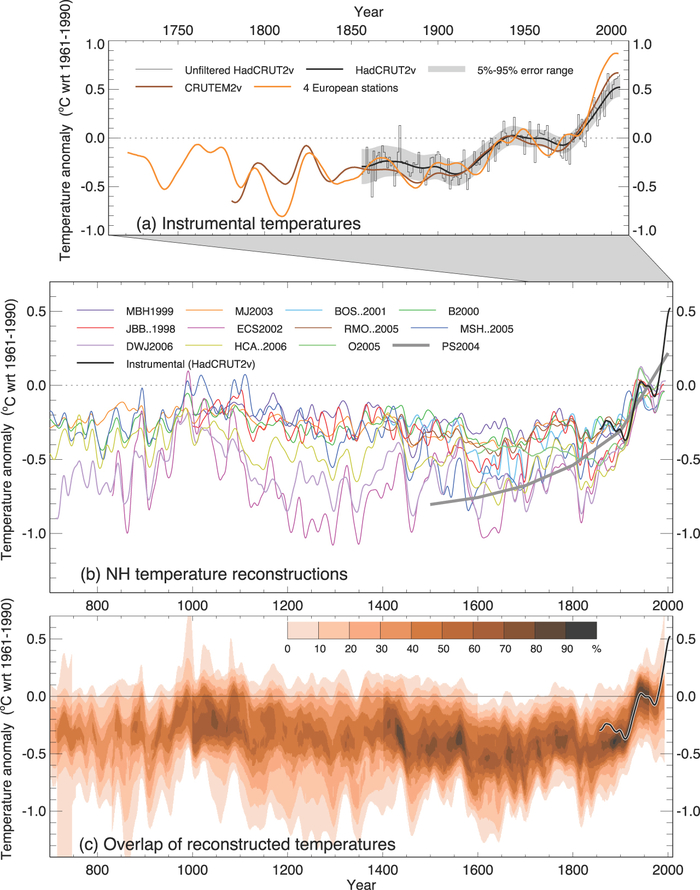
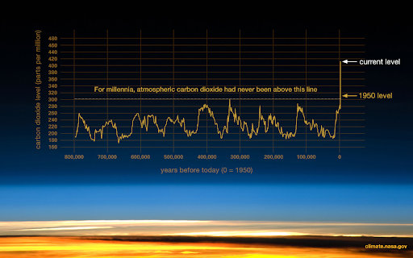
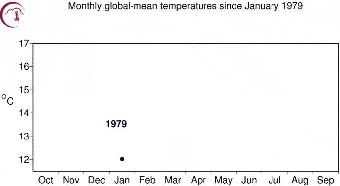

# Intro to climate change

## Mental health resources

Climate change can be a scary subject, and it’s not unusual to feel anxious, sad, afraid, or depressed while discussing it. While it is important to be educated about climate change, it's even more important to take care of your own mental health. Before we begin, here are some tips on how you can take care of yourself while learning to take care of the planet:

- Be open to discussions about how you feel with your friends, family, and teachers. You are not alone in your concern for the environment.
- Stay educated about climate change, but do so in moderation. Don't feel like you need to stay up to date with every devastating news headline! Stress can motivate us to take action, but it can also lead to burnout.
- Prioritize researching solutions over forecasts and predictions, and take action! You are not powerless in fighting climate change. In this curriculum, you will learn about changes you can take individually, as well as larger-scale projects that you can advocate for.
- Remember that there are many people, organizations, and politicians who support climate science and who are pursuing the solutions outlined in this curriculum! Saving the planet is an urgent and daunting task, but your teammates are working hard right beside you.
- Value your own mental health. Make time to exercise, spend time in nature, pursue hobbies, sleep and eat well, keep mindful limits on screen time, and spend time with friends and family.

If you ever need to talk about feelings caused by these heavy topics, we're here for you. Email us at [hello@climatedu.org](mailto:hello@climatedu.org), or DM us on Instagram @climateduteam. Let's get to learning!

## What is climate?

### Climate vs. weather

Climate and weather are probably not new terms to you, but many people don’t know the difference between the two and use them interchangeably - and yet, there is an important distinction. Before we jump into content, think of words you would use to describe the climate and keep them in mind when you are watching the following video.

<iframe width="560" height="315" src="https://www.youtube-nocookie.com/embed/YbAWny7FV3w" frameborder="0" allow="accelerometer; autoplay; clipboard-write; encrypted-media; gyroscope; picture-in-picture" allowfullscreen></iframe>

Reflecting on that video, are the words you used to describe climate still appropriate, or are some of them describing weather? Check out the following reading to learn more about the difference between climate and weather and also read about global versus regional climates and how climates change.

- [NOAA Article on Climate vs Weather](https://www.ncei.noaa.gov/news/weather-vs-climate)

**Q: Based on these two sources, define climate and weather in your own terms.**

<textarea data-unit="1" data-key="1" id="1.1" placeholder="Enter your response here." onblur="updateResponse(this)" oninput="editedResponse(this)"></textarea>

**Q: Was the visual of the clothing you wear on a specific day versus the clothing in your closet helpful? Can you think of another analogy illustrating the difference between climate and weather?**

<textarea data-unit="1" data-key="2" id="1.1" placeholder="Enter your response here." onblur="updateResponse(this)" oninput="editedResponse(this)"></textarea>

## The ins and outs of sunlight and our atmosphere

### Energy budget

Here’s another short section that will give you some context before we learn more in-depth about greenhouse gases. Here, you will learn about Earth’s energy budget through a video and a short article. When watching the short video, pay close attention to the path that energy takes through our atmosphere (how it enters, where it is absorbed, etc.).

<iframe width="560" height="315" src="https://www.youtube-nocookie.com/embed/82jE-yvB8xU" frameborder="0" allow="accelerometer; autoplay; clipboard-write; encrypted-media; gyroscope; picture-in-picture" allowfullscreen></iframe>

**Q: Summarize what you learned in the video (Ex: where does Earth’s energy come from?** **What are some ways that the planet is heated or cooled? What is the connection between the color of surfaces and the amount of energy they absorb/reflect?)**

<textarea placeholder="Preview submission area. Answers are not saved."></textarea>

Remember back to the introduction to the last video, where you were asked to pay attention to how energy enters the atmosphere, where it is absorbed, reflected, etc. Take a look at the diagram at the top of this article for a visual of these pathways. If you don’t understand all of them, don’t worry.

- [Short NASA Article about the energy budget](https://www.nasa.gov/feature/langley/what-is-earth-s-energy-budget-five-questions-with-a-guy-who-knows)

Focus mostly on the paragraphs: Why is it important for us to study the energy budget? & In the simplest terms possible, what is Earth’s energy budget?

**Q: How do regional imbalances in energy contribute to and drive oceanic and meteorologic patterns?**

<textarea placeholder="Preview submission area. Answers are not saved."></textarea>

## Greenhouse gases

Here’s an introduction video to greenhouse gases, an important part of our atmosphere. Keep in mind that the “jiggly” molecules described in these videos are the greenhouse gases. Pay attention to what helps to regulate the temperature of the Earth (versus the Moon).

- [MinuteEarth Video on “How Do Greenhouse Gases Actually Work?”](https://www.youtube.com/watch?v=sTvqIijqvTg) -

What are some examples of greenhouse gases (what the video refers to as “electrically-lopsided”)? What do they do to infrared radiation? This video discussed a game of pinball, trying to bounce rays out of the atmosphere, and how having more greenhouse gases in the atmosphere makes this much harder than on the moon, for example.

Predict the effect of increasing greenhouse gas emissions by humans on the Earth’s energy budget. Then, read the background reading at the following link and watch the video.

- [PBS Learning Media Video](https://mpt.pbslearningmedia.org/resource/phy03.sci.phys.matter.greenhouse2/global-warming-the-physics-of-the-greenhouse-effect/)

**Q: What are some natural phenomena that produce greenhouse gases? What are some man-made producers?**

<textarea placeholder="Preview submission area. Answers are not saved."></textarea>

**Q: What is the relationship between increased carbon dioxide in the atmosphere and global warming?**

<textarea placeholder="Preview submission area. Answers are not saved."></textarea>

## Carbon cycle

Let’s start off with something that might seem unrelated. When you see the words “water cycle”, what’s the first thing you picture? Most people can picture how water cycles through our environment.

However, when it comes to the words “carbon cycle”, it’s more difficult to picture. Instead of water, carbon dioxide — also known as CO2 — is invisible. It doesn’t rain down in storms or fill an entire ocean. Just because you can’t see it, though, doesn’t mean it’s not important.

In fact, carbon dioxide is one of the biggest **greenhouse gases**. Like we learned about previously, carbon dioxide can absorb infrared radiation from the Earth’s surface and act as a blanket. As CO2 concentrations rise in the atmosphere, more radiation is trapped, and Earth gets warmer. So why does the atmospheric concentration increase? Because the carbon cycle gets disturbed.

Just like how oceans and clouds store water in the water cycle, there are places where carbon is stored in the carbon cycle. A **carbon sink** is a reservoir that absorbs carbon from the atmosphere and stores it. So what are some examples of these carbon sinks? The most common example is a forest.

As the plants in a forest photosynthesize, they use CO2 in the air and store it. As forests grow bigger and more trees are planted, more and more carbon is absorbed from the atmosphere. It is estimated that around 2,200 gigatons (1 gigaton = 1 billion tons) of carbon is stored in plants and soil globally. This is about 25% of the carbon emitted to the atmosphere by humans.

Another example of a carbon sink is the ocean! Known as the “oceanic sink”, the amount of carbon stored is greater than the amount of carbon in the atmosphere (about 760 gigatons). The ocean stores almost half (45%) of the carbon emitted to the atmosphere by human activity! How does this work? At the surface of the ocean, where the water meets the atmosphere, CO2 is dissolved. As the water circulates in the shallower regions of the ocean, the CO2 in the atmosphere and the CO2 dissolved in the ocean interchange as water is pushed up to the surface.

So if we have these methods of storing CO2, why can’t we find a way to put all of our extra CO2 there too? The issue is, these natural carbon sinks have a maximum limit. For example, when too much CO2 is present in the ocean, **ocean acidification** occurs, which can harm marine life.

Additionally, these carbon sinks can become **carbon sources** instead. Just like how a cloud can store water but also release water through rain, sometimes natural carbon sinks release more carbon than they store. When deforestation occurs, the carbon that these forests contained turns into CO2 emissions. This is also the case with reserves of coal, oil, and natural gases — also known as **fossil fuels**. Undisturbed, the CO2 trapped in these reservoirs is not released to the atmosphere. However, when humans use these fuels, they release a lot of carbon into the atmosphere.

One way that people can help re-collect the CO2 released from carbon sources is through **carbon sequestration**! By changing how people use land, either through **afforestation** where forests are planted on land that didn’t have forests before or **reforestation** where forests are planted on land that used to have forests, the effects of CO2 in the atmosphere can be diminished.

One good way of keeping carbon sinks, carbon sources, and carbon sequestration straight is to think about it like this. A forest that is getting cut down is an example of a carbon source, planting new forests and letting them grow is a type of carbon sequestration, and the forests themselves are the carbon sinks!

**Q: Do you know any other examples of carbon sinks or carbon sources? Can they only be natural, or can you have man-made carbon sources and carbon sinks too?**

<textarea placeholder="Preview submission area. Answers are not saved."></textarea>

## Our carbon footprint

Our **carbon footprint** is defined by the total amount of greenhouse gases (otherwise known as GHGs) that we emit as a result of our actions. Just like a regular footprint, a carbon footprint refers to the mark that we leave on the world— a _bad_ mark that gets bigger as we use more. We add to our carbon footprint when we use dirty energy, drink from plastic bottles, drive around in our cars, and more. Watch this video provided by Our Climate Our Future, which discusses how we're "living large" in the United States.

<iframe width="560" height="315" src="https://player.vimeo.com/video/259048238?title=0&byline=0&color=ffffff&app_id=122963" frameborder="0" allow="accelerometer; autoplay; clipboard-write; encrypted-media; gyroscope; picture-in-picture" allowfullscreen></iframe>
 
<figcaption>Living Large, Our Climate Our Future Ep. 2</figcaption>

Pretty crazy, right? As you can see, there's a tight link tying the space and resources we use to the energy that we consume, which directly leads to a larger carbon footprint when powered by fossil fuels like coal, oil, and natural gas. A larger carbon footprint means more greenhouse gases in the atmosphere, which in turn means more sunlight trapped on a hotter earth.

It's more complicated than using electricity at home or driving around, though. Check out this fun video by NPR's Skunk Bear breaking down the carbon footprint caused by eating a single BLT sandwich

- [The Carbon Footprint of a Sandwich](https://www.youtube.com/watch?v=jRQEi-C5GDg), NPR's Skunk Bear

Are you curious about your carbon footprint? Let's get an estimate with an ecological footprint calculator! You might need to ask a parent for help, with questions like how many miles your car travels per year, or the size of your house in square feet.

- [Ecological Footprint Calculator](https://www.footprintcalculator.org/), Global Footprint Network

**Q: When's your Earth Overshoot Day? How many Earths would we need if everyone lived like you? Sum up your results from the many pages, and reflect on what they mean.**

<textarea placeholder="Preview submission area. Answers are not saved."></textarea>

**Q: Play around with some of the variables, such as how often you drive by car or eat animal products. How do these change your footprint? Which variables seem to have a larger effect?**

<textarea placeholder="Preview submission area. Answers are not saved."></textarea>

There's no need to feel guilty about your carbon footprint, but we can certainly do a lot better in our own lives. Think about steps you'll take to reduce your own carbon footprint, and we'll discuss many in the upcoming units.

## How do we measure climate change?

Before we begin, take a minute to brainstorm some potential variables that you might want to track in order to measure climate change. If you’re working with a class, feel free to brainstorm in small groups or as a class.

Now, let's read the following article to understand the Global Climate Observing System's seven main indicators. It’s okay if you don’t understand all of them; some of them (such as ocean acidification) will be explained in sections to come. For now, just know that these are reliable indicators of a changing climate.

- [Global Climate Indicators](https://gcos.wmo.int/en/global-climate-indicators), Global Climate Observing System

Of course, there are many other variables, many of which you might have included in your brainstorming. These include regional temperature, permafrost and snow cover, changes in ocean currents and salinity, precipitation, changes in the biosphere (be it changes in vegetation cover or animal migration schedules), and many, many more. But we’ll focus on these seven.

How do we measure these variables?

- For temperature measurements, there are thousands of weather stations around the world that gather data on temperature, precipitation, and other weather variables. Combining this data to determine global temperature can be a little complicated, but you can learn more about this process in [this](https://www.carbonbrief.org/explainer-how-do-scientists-measure-global-temperature) optional reading.
- Ocean height and surface temperature are measured with satellites, while acidity, salinity, and subsurface temperature can be measured with ship instruments or moored buoys.
- The cryosphere indicators (glaciers and sea ice) are mainly measured with satellite imagery, as well as aerial photography and radar from planes [such as operation IceBridge](https://icebridge.gsfc.nasa.gov/). Many other variables, like snow and vegetation cover, are also measured this way.

As for measuring atmosphere composition, it’s a little bit more complicated. Explore the following website to learn more about the process:

- [Measuring atmospheric composition](https://gcos.wmo.int/en/global-climate-indicators)

Taking a closer look at these pages:

- Air Sampling Network Introduction
- Surface Network
- Aircraft
- Tall Towers
- Flasks Logistics Lab
- Why Do We Measure the 6 Gases We Do?

Those are the seven GCOS indicators, but if you want to learn more about the measurement of other variables, you can refer to [this website](https://www.climate.gov/maps-data/primer/measuring-climate), especially its pages on the analysis of[ land](https://www.climate.gov/maps-data/primer/land-terrestrial-climate-variables), [air](https://www.climate.gov/maps-data/primer/air-atmospheric-climate-variables), and [sea](https://www.climate.gov/maps-data/primer/ocean-oceanic-climate-variables) variables.

We haven’t always had satellites and weather stations and radar and gas composition labs. So how do we know what the climate was like in the past?

Luckily, we actually have several ways to measure the **paleoclimate**, meaning the climate of the past (from a few hundred years ago up to even millions of years ago!). We know that these measures are reliable because not only do they agree with each other, but when they are used to measure the current climate, they line up with the measurements of our instruments. Here are a few of the methods that you should know.

**Tree rings:** you probably already knew that you can count a tree’s rings to determine its age. But the ring itself can actually tell you a lot about what that year was like! Trees grow faster in warmer, wetter weather and grow more slowly when it’s cold or during droughts, so years with wide rings will be warmer than those with narrow rings. Rings may also contain additional clues about the climate through scarring or their chemical makeup. In order to study these rings without cutting down the tree, climate scientists take “cores,” meaning they drill into a tree’s center and extract a thin rod that includes a sample of every ring, all while doing minimal damage to the tree. Cores from old trees allow us to study the climate over the past few hundred years, enough to know what the climate was like before we started burning fossil fuels in the 18th and 19th centuries.

**Ice cores:** in places where it is below freezing year-round, each year’s snow will fall on top of the previous year’s, which itself sits on top of the previous year’s, which itself sits on top of the previous year’s, and so on and so forth. The weight of decades worth of snow is enough to crush the lower layers into solid ice, forming a glacier. When the snow freezes, it also traps air bubbles with it, preserving a record of that year’s climate. Just like with tree cores, climate scientists can drill samples from the ice and study the layers left by each year’s snowfall. The ice core is cut into samples, each with a few layers, which are then melted to release the air bubbles trapped inside. We can then perform composition analysis to determine the greenhouse gas content of the atmosphere at the time the layer froze. You can learn more about ice cores [here](http://icecores.org/icecores/index.shtml).

**Other methods:** these include looking at geology to determine the extent of past glaciers, or to see how the sea level has changed over time. We can also study the distribution of fossils, examine sediments in lakes and on the ocean floor, analyze coral reefs, and even dig holes to take the temperature of rocks deep in the Earth’s crust. To learn more about these and many other methods, click [here](https://www.ncdc.noaa.gov/data-access/paleoclimatology-data/datasets).

The following graph has a line for each different method of measuring climate we use (including modern instruments) over the past thousand years. You can see for yourself just how closely these methods align, both with each other and with modern measurements. You can also clearly see the modern climate rapidly deviating from the historical norm.

Northern Hemisphere Climate Reconstruction. Image source: IPCC AR4 WG 1 figure 6.10.

What do the data show? Ultimately, it is indisputable that humans are causing climate change. While we do have evidence that the climate has changed in the past, it has never, ever come anywhere near the extreme pace with which the atmosphere and the climate have changed since humans started burning fossil fuels. And as the CO2 data shows, it is inextricably linked with the greenhouse gases humans are putting in the atmosphere.

Take a look at the graphics below.

So we’ve talked about measuring the climate of the past and present. What about the climate of the future? Do we have any way to measure that?

Well, we can’t exactly measure it. But we can do our best to predict it using climate models. Read through this next article to learn how these models work and what they are used for. Make sure to explore the [Very Simple Climate Model](https://scied.ucar.edu/interactive/simple-climate-model) linked in the article!

- [Climate Models](https://www.climate.gov/maps-data/primer/climate-models), Climate.gov

To read more about what specifically goes into these models, you can optionally read [this article](https://www.climatecentral.org/news/ipcc-predictions-then-versus-now-15340) from the Intergovernmental Panel on Climate Change. Models like the IPCC’s are a big part of how we set our goals in limiting climate change, as they allow us to simulate scenarios where we limit our emissions as well as scenarios where we don’t. These allow us to set goals, such as the 2 C goal of the Paris climate accords, to avoid the worst impacts of climate change. But it’s important to remember that the targets these models come up with are just that—targets. It is up to us to meet them.
